# Lab 10

## Lab 10 Outcomes

At the conclusion of this lab, you will be able to manage, edit, and list system processes in systemd--helping you to master the concepts of systemd. After each item take a screenshot and place it below the question to demonstrate the answer (unless specified otherwise). Edit your screenshots to show just the relevant information.

1) Change the default GRUB settings on your Ubuntu virtual machine uncommenting the entry `GRUB_DISABLE_RECOVERY="true"`. Save the changes the GRUB configuration file, reboot the virtual machine, repeating the process in the first question, and now take a screenshot of the same menu that is missing the recovery options. Hold the **shift** key down until you see the GRUB menu for some Linux distros.

1) Type the command to display your default `target` environment

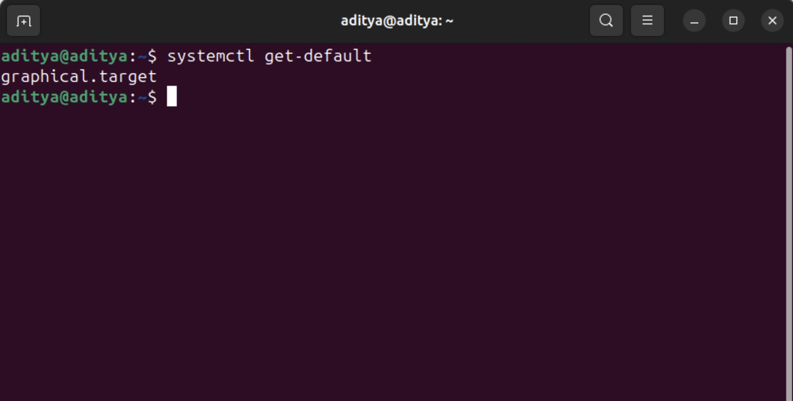

1) Install the `openssh-server` package on your distro. Type the 3 commands be to enable the service to start at boot, start the service running, and check the service status?

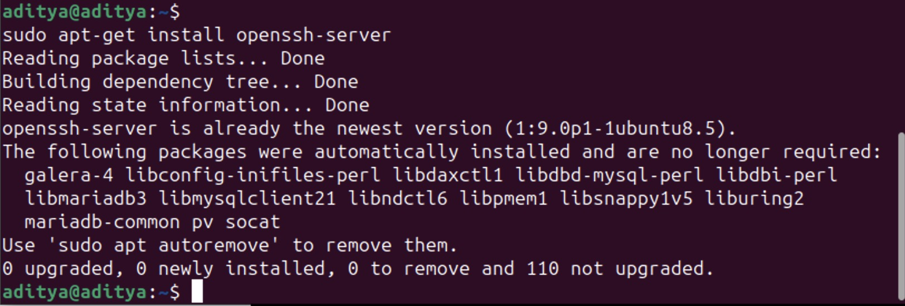

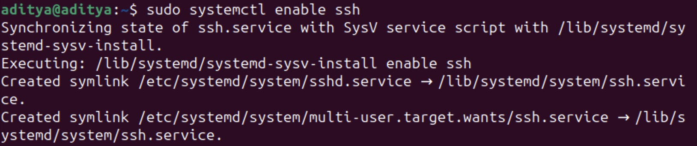

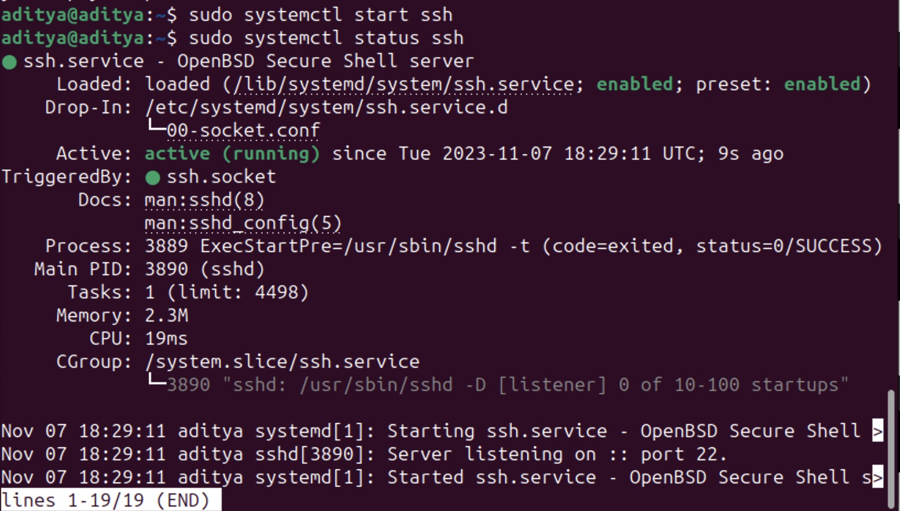

1) Install the Nginx webserver package. What is the location on the filesystem of the `.service` file?

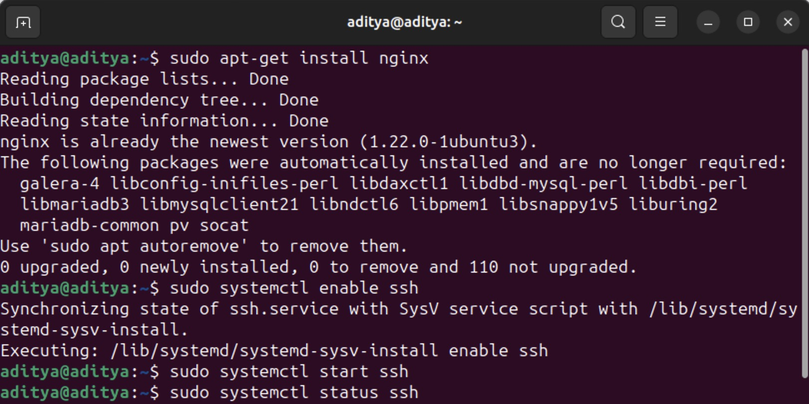

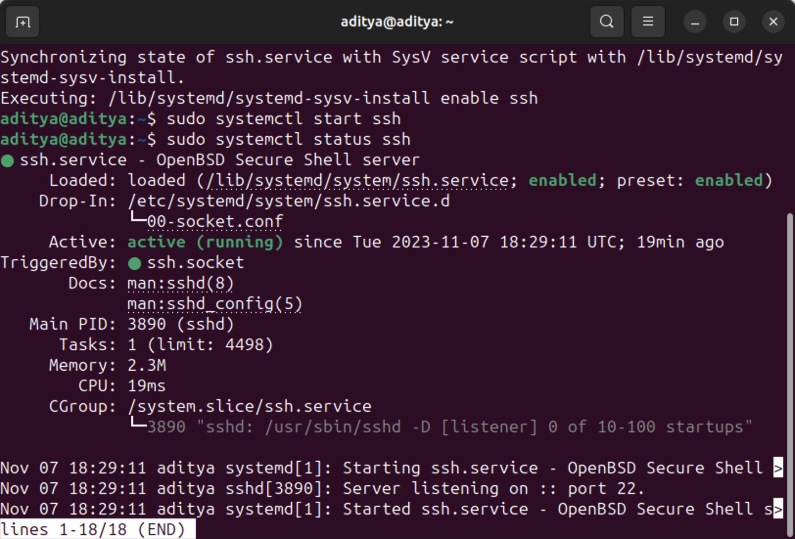

1) Breifly explain the recommended purpose of `/etc/systemd/system`  and `/lib/systemd/system`

/etc/systemd/system is intended for system administrators and users to customize and override the system's default unit files.

/lib/systemd/system directory contains the default unit files provided by the distribution or packages you've installed.

1) Type the systemctl command to stop the Nginx service

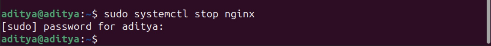

1) Type the systemctl command needed to process changes to configuration files before restarting a service

1) Type the systemctl command that will retrieve and display the `ExecStart` property from the Nginx.service file (not grep)

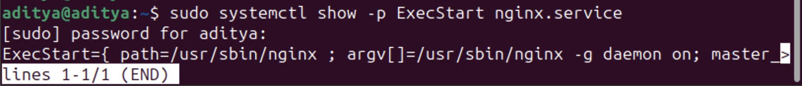

1) Type the systemctl command that will retrieve and display the `WantedBy` property from the Nginx.service file (not grep)

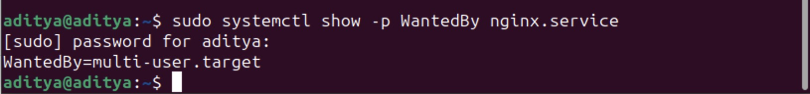

1) Using the `man` command explain what `timedatectl` does?

It may be used to query and change the system clock and its
settings, and enable or disable time synchronization services.

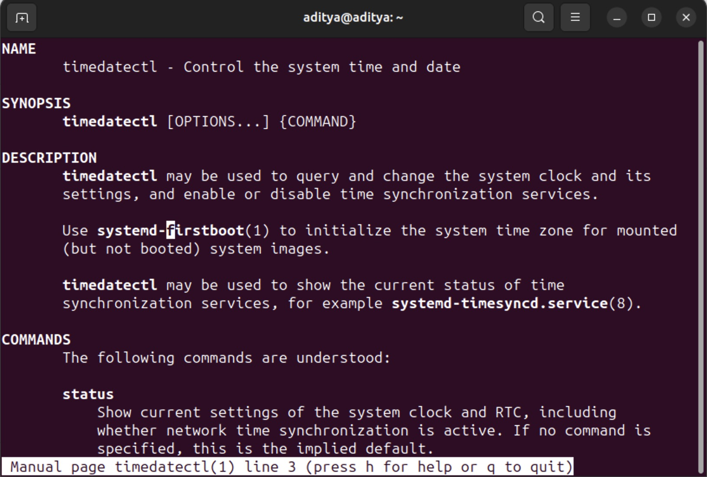

1) Using the `man` command explain what `journalctl` does?

journalctl may be used to query the contents of the systemd(1) journal
as written by systemd-journald.service(8).

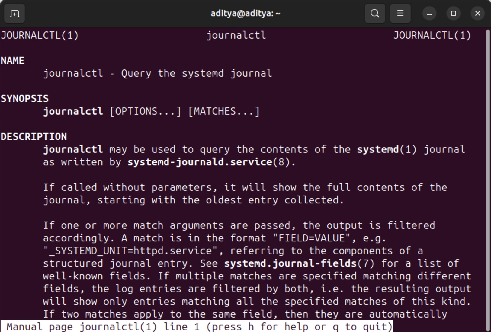

1) Using the `man` command explain what `resolvectl` does?

resolvectl may be used to resolve domain names, IPv4 and IPV6 addresses, DNS resource records and services with the systemd- resolved.service(8)

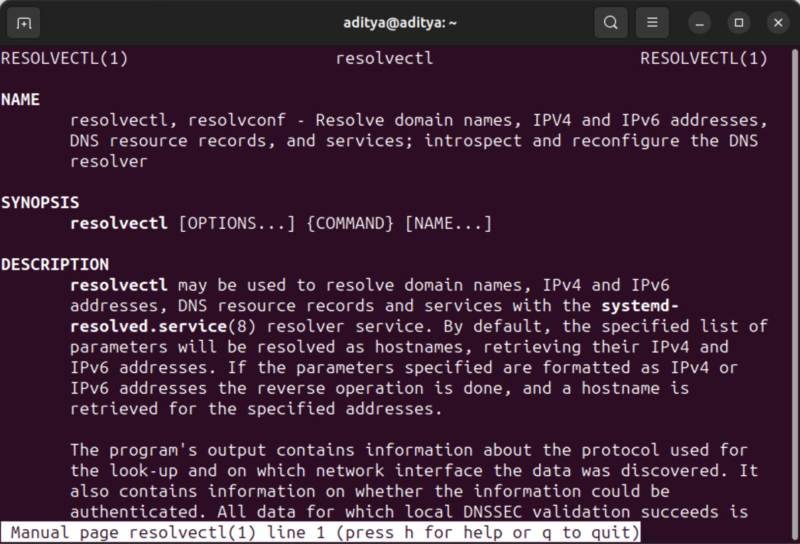

1) Using the `man` command explain what `networkctl` does?

networkctl may be used to introspect the state of the network links as seen by systemd-networkd. Please refer to systemd-networkd.service(8) for an introduction to the basic concepts, functionality, and
configuration syntax.

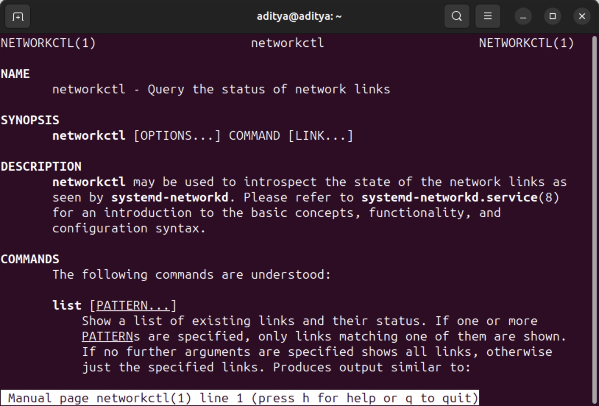

1) Using the `man` command explain what `hostnamectl` does?

hostnamectl may be used to query and change the system hostname and
related settings.

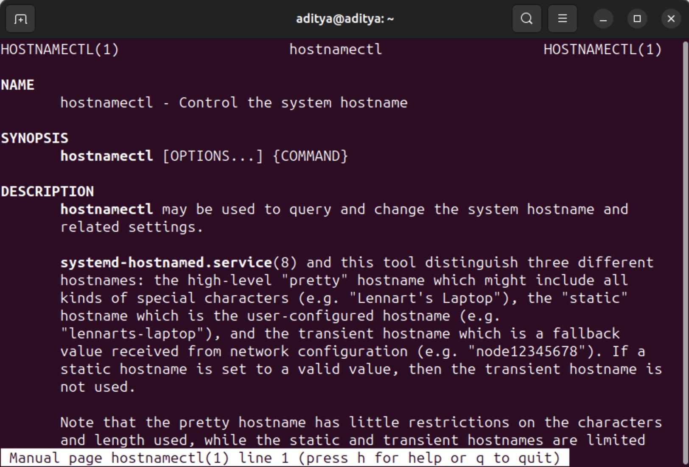

1) Install the package for `systemd-oomd`, using the `man` command explain what `oomctl` does?

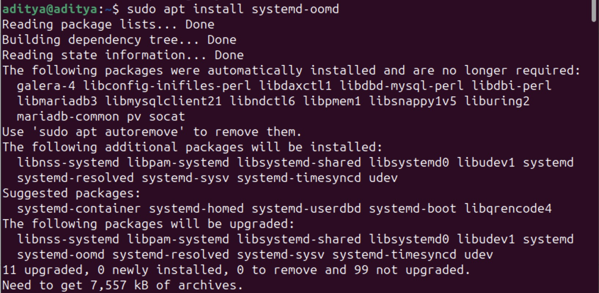

1) List the three headers or parts of a `.service` file?

to be done

1) Using the command `timedatectl status`, copy the text output to your answer here. Use the `man` command to find hwo to change your system clock to `UTC`. Run the `timedatectl status` again and copy the output showing the difference--a screen shot is acceptable as well.

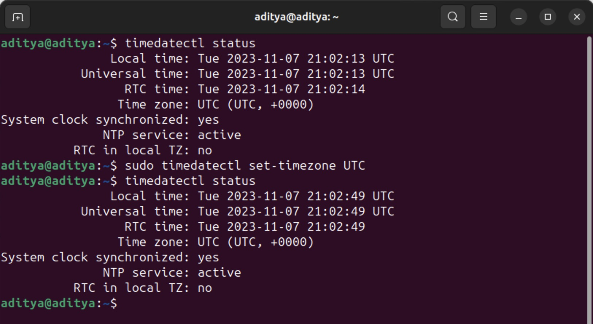

1) Use the `hostnamectl` command to:
   a) set-hostname to itmo-556-xyz (xyz is your initials)
   b) set-location to: d1r1u22
   c) set-chassis to: vm
   d) set-deployment to: development
   e) display the changes by issuing the `hostnamectl` command

   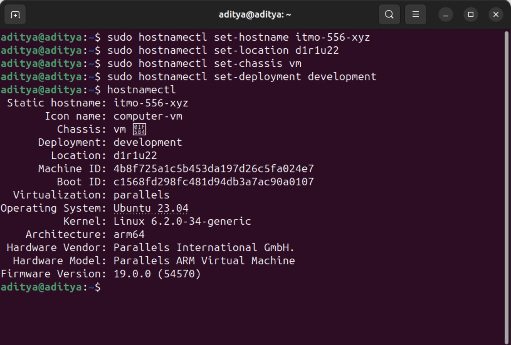

1) Use one of the tools described in the **Filesystems /proc** section and print out the exact processor/cpu type your Linux system is reporting.

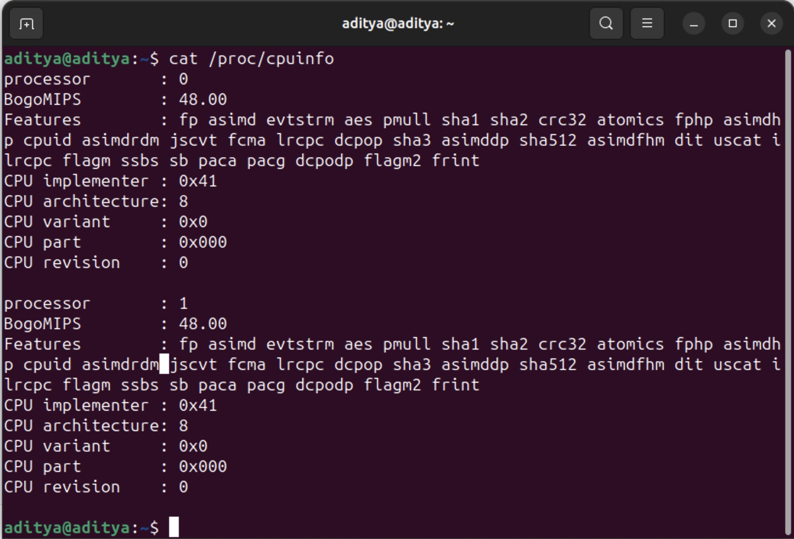

1) In the textbook sample code: files > Chapter-10 > service-files there is a `.service` file named write-journal.service. Issue the commands to enable and start this service. This will require you to beforehand install the pre-requisite packages and create the `write-journal.py` script: the code is in the section **Logging and Service Files**. Write a `.timer` unit file (remember to enable and start the timer unit file), which will execute your `write-journal.service` once every 5 minutes.  Take a screenshot of the output of the `journactl` command that will show logs from only the `write-journal.service` showing that 10 minutes approimately elapsed. Take an additionl screenshot of the status of the systemctl timers to show the timer unit has been registered.
